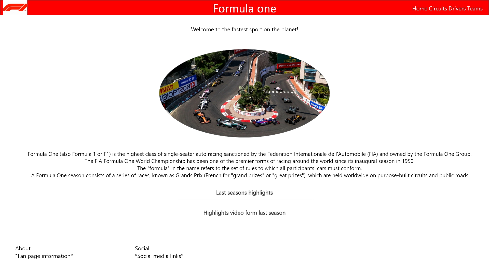
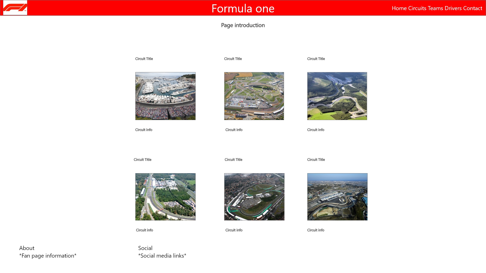
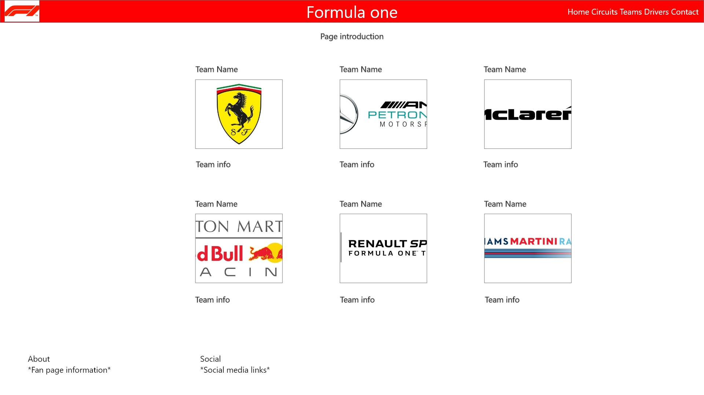
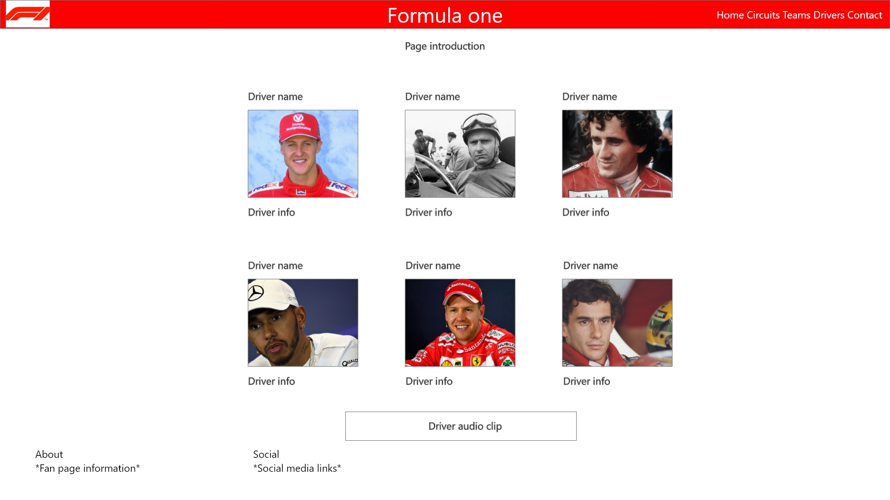
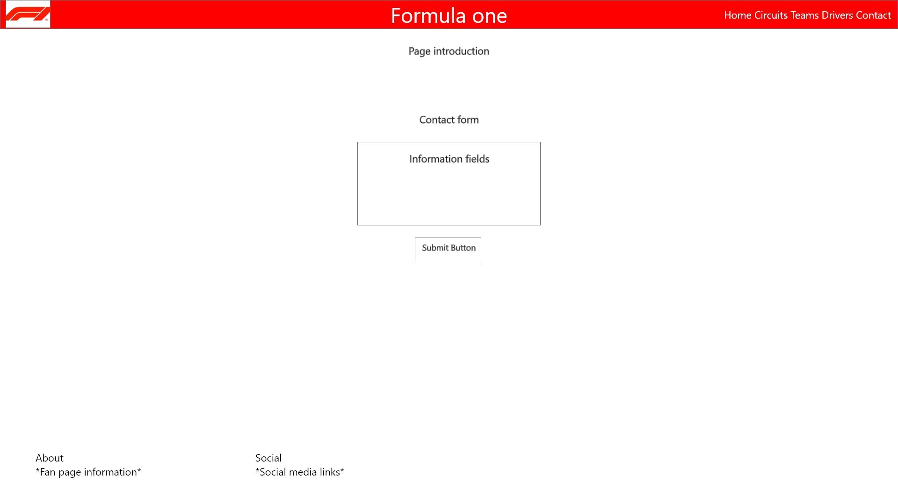
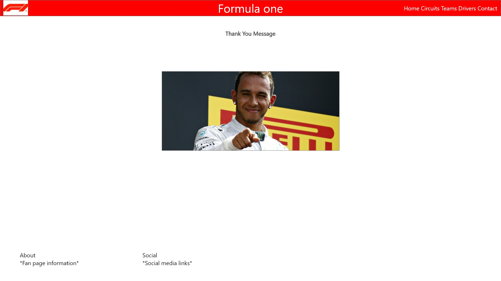

# UCD Milestone Project for Codeinstitute Full Stack Course

I have created a Formula One fan page with some information about the circuits, drivers and teams, because of my love of the sport.

## Target Audience and Functionality

To provide any persons who are unfamiliar with the sport a little description of the sport and some basic, uncomplicated information to attract them.

To provide any existing fans of the sport some topical information about their favourite circuits/drivers/teams in an easy to read format to avoid accessing from multiple sources.

Also provides a direct link to all social media sources for the sport across various platforms (Facebook, Instagram, Twitter, Youtube, Official website).

## Criteria

Guideleines from the Codeinstitute:

1. Create a website of around 4-5 pages, or (if using a single scrolling page) these should be separate page areas.
2. Incorporate main navigation and grid layout (you might want to use Flexbox or Bootstrap to accomplish this).
3. Whenever possible, strive to use semantic HTML5 elements to structure your HTML code better.
4. Make sure your site is as responsive as possible. You can test this by checking the website on different screen sizes and browsers.
5. We advise that you write down user stories and create wireframes/mockups before embarking on full-blown development.
6. The site can also make use of CSS frameworks such as Bootstrap, just make sure you maintain a clear separation between the library code and your code.
7. You should conduct and document tests to ensure that all of your website’s functionality works well.
8. Write a README.md file for your project that explains what the project does and the need that it fulfills. It should also describe the functionality of the project, as well as the technologies used. Detail how the project was deployed and tested and if some of the work was based on other code, explain what was kept and how it was changed to fit your need. A project submitted without a README.md file will FAIL.
9. Use Git & GitHub for version control. Each new piece of functionality should be in a separate commit.
10. Deploy the final version of your code to a hosting platform such as GitHub Pages.

## Mockup/Wireframes

**Homepage**

**Circuits Page**

**Teams Page**

**Drivers page**

**Contact page**

**Thanks page**

## Testing

**Chrome** - Functions/Links/Contact/Video/Audio - Passed 

**Firefox** - Functions/Links/Contact/Video/Audio - Passed

**Edge** - Functions/Links/Contact/Video/Audio - Passed

**Opera** - Functions/Links/Contact/Video/Audio - Passed

**Safari** - Unable to test - N/A

# Author

Simon Law

## Assets obtained from outside sources:

* All Images from google image search
* Videos from youtube channel [**F1 Crashes**](https://www.youtube.com/channel/UC5vU-xt5wvm5LD8EPZIsozw) and embedded code directly from the site
* Circuit information directly from official Formula 1 website, linked in the footer of each page
* Driver information and team information also from the same source as circuit information
* Social media links take directly to the official pages of the sport
* Wikipedia
* Bootstrap
* Google Fonts